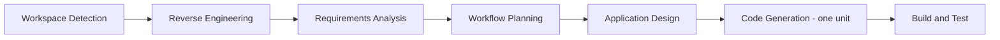

# Execution Plan — GSAP Dark-Chalkboard Restyle

## Scope / Impact / Risk (proportional)
- **Scope:** reskin + native animation layer over an existing static single-page portfolio.
  3 files touched: `index.html` (nav → top bar, marquee strip, reveal hooks),
  `css/main.css` (full token swap, component reskin, animation keyframes),
  `js/main.js` (IntersectionObserver reveals, timeline draw, stagger wiring).
- **Impact:** visual only. Content, links, dialogs, and accessibility patterns unchanged.
- **Risk:** Low — no build, no dependencies, reversible via git.

## Stage plan (lean default + earned additions)

| Stage | Status | Reason |
|---|---|---|
| Workspace Detection | ✅ EXECUTED | always |
| Reverse Engineering | ✅ EXECUTED | brownfield, no prior artifacts |
| Requirements Analysis | ✅ EXECUTED | always (minimal depth) |
| Workflow Planning | ▶ NOW | always |
| Application Design | ▶ EXECUTE | earned — real shape decisions: token system swap, sidebar→top-bar layout change, animation-system contract. Recorded in `design-decisions.md` for downstream passes |
| Units Generation | ⏭ SKIP | default one unit (`portfolio-site`); no decomposition earned |
| Functional Design | ⏭ SKIP | no business logic — visual restyle; design detail lives in Application Design |
| User Stories | ⏭ SKIP | single stakeholder |
| NFR Requirements / Design | ⏭ SKIP | no present non-functional need beyond the binding WCAG AA baseline and existing reduced-motion handling |
| Infrastructure Design | ⏭ SKIP | no infra change (GitHub Pages unchanged) |
| Code Generation | ▶ EXECUTE | one unit: modify the 3 existing files in place |
| Build and Test | ▶ EXECUTE | no build step; verification = browser visual/interaction check; tests not earned (no logic beyond IO wiring; existing JS preserved) |

## Orchestration note
Parallel worker orchestration is NOT earned here: three tightly coupled files forming one visual
system. Splitting them across workers would create merge friction with no throughput gain.
Single sequential flow.

## Success criteria
- Site renders the dark chalkboard design (canvas `#0e100f`, cream `#fffce1`, green accent).
- All 7 requested animation pieces work; `prefers-reduced-motion` disables them.
- Nav is a slim top bar; mobile toggle works; dialogs and scrollspy unchanged.
- No console errors; WCAG AA contrast holds; page loads with no new dependencies.
